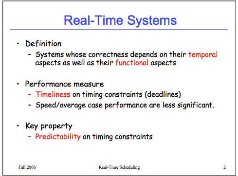

# Real-time Scheduling of Dataflow  Graphs
([link](https://drive.google.com/open?id=0B_10gtxnPV-_TmdDdzJjREdZMUU))

## Dataflow models of computation
- Kahn process networks
- Dataflow process networks
- Dataflow synchronous languages
  - Directed graph where computation nodes (actors) communicate via one-to-one FIFO buffers. Actor consumes predefined number of tokens from its input channels and produces a predefined number of tokens on its output channels (either constant or cyclically changing)
  - Less expressive than the first two, but easy to model
  - Expressive enough for most of digital signal processing (DSP)
  - Both whether the system can be executed with bounded buffers and whether each actor can fire infinitely often are decidable. Can easily construct static-periodic schedules (i.e., infinite repetitions of firing sequences of actors)

Other models
- Actor models
- Petri nets

## Assumptions
- Periodic (i.e., sample at regular intervals)
- Embedded (i.e., integrates software with hardware to accomplish some dedicated function subject to physical constraints)
- Reactive (i.e., maintains permanent interaction with environment); all reactive systems are embedded systems, but not vice versa
- Relies on real-time operating system

## Notes on real-time operating systems
[link](http://www.cis.upenn.edu/~lee/06cse480/lec-real-time-scheduling.pdf) [wiki](https://en.wikipedia.org/wiki/Real-time_operating_system)

